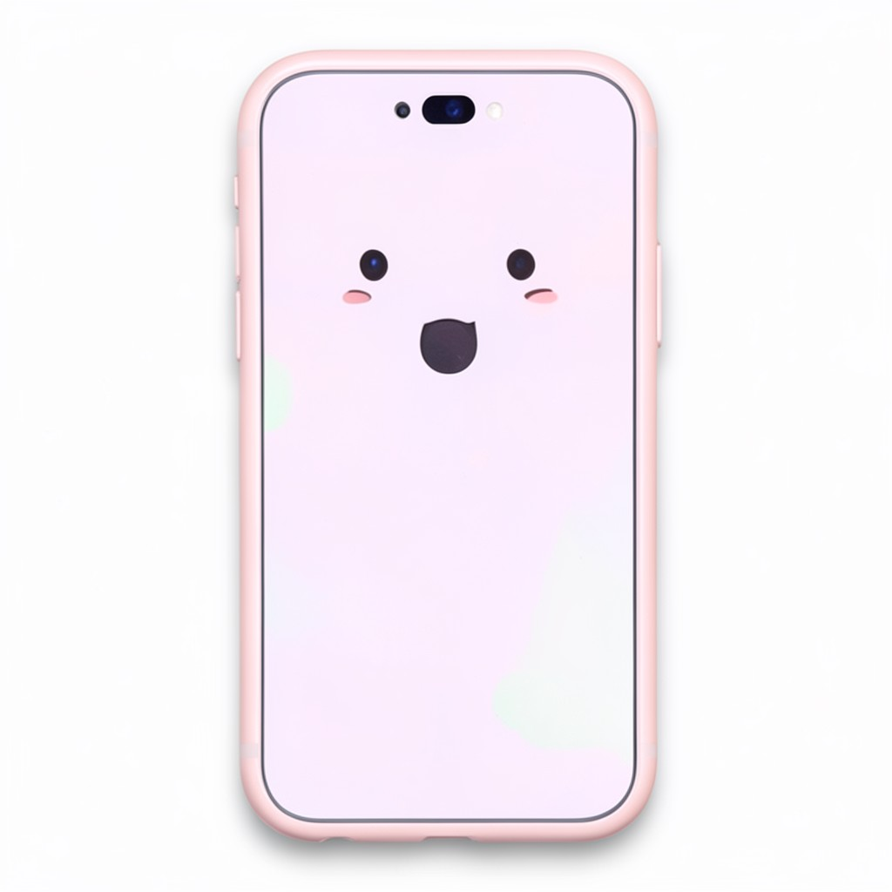

# 🖼️ AI Image Generation Chatbot (Streamlit + NVIDIA FLUX)

A Streamlit-based chatbot that generates images from text prompts using the NVIDIA AI API and the **FLUX text-to-image model**.

Users can describe an image in natural language, and the application generates a high-quality image in response.

---

## 🚀 Features

- 💬 Chat-style interface built with Streamlit
- 🎨 Text-to-image generation using NVIDIA FLUX model
- 🧠 Prompt-based image generation
- 🖼️ Real-time image rendering
- 📥 Download generated images
- 🔐 Secure API key management with `.env`

---

## 🏗️ Project Architecture
User Prompt
│
▼
Streamlit Chat UI
│
▼
Python Backend
│
▼
NVIDIA AI API (FLUX Model)
│
▼
Base64 Image Response
│
▼
Decode Image
│
▼
Display in Streamlit UI


---

## 🖼️ Demo

### Chat Interface


### Generated Image Example


---

## 📂 Project Structure

```bash
.
├── app.py
├── requirements.txt
├── .env
├── README.md
└── images
    ├── chat_ui.png
    └── generated_image.png

⚙️ Installation
1️⃣ Clone the Repository
git clone https://github.com/yourusername/ai-image-chatbot.git
cd ai-image-chatbot
2️⃣ Create Virtual Environment
python -m venv venv
source venv/bin/activate

Windows:

venv\Scripts\activate
3️⃣ Install Dependencies
pip install -r requirements.txt
4️⃣ Add API Key

Create a .env file:

NVIDIA_API_KEY=your_api_key_here
5️⃣ Run the Application
streamlit run app.py

The app will open in your browser:

http://localhost:8501
💡 Example Prompt
A macro wildlife photo of a green frog in a rainforest pond, highly detailed, eye-level shot
🔧 Tech Stack

Python

Streamlit

NVIDIA AI API

FLUX Text-to-Image Model

Requests

Base64 Image Decoding

📸 How Image Generation Works

User enters a text prompt

Prompt is sent to the NVIDIA FLUX API

API generates an image

Response returns a Base64 encoded image

The image is decoded in Python

Streamlit displays the generated image

📦 Requirements

Example requirements.txt

streamlit
requests
python-dotenv
🛠️ Future Improvements

🎨 Multiple image styles (anime, realistic, cinematic)

📚 Image history gallery

💬 Conversation memory

⚡ Faster image generation options

📤 Image sharing support

📜 License

MIT License

🤝 Contributing

Pull requests are welcome! For major changes, please open an issue first.

⭐ Support

If you found this project useful, consider giving it a ⭐ on GitHub.


Diagram:


User Prompt
↓
Streamlit Chat UI
↓
Python Backend
↓
NVIDIA FLUX API
↓
Base64 Image
↓
Decode
↓
Display Image